# 🏥 Disease Prediction Using Machine Learning  

This repository contains a **Machine Learning Classification Model** designed to predict human diseases based on given symptoms. The project follows a structured ML pipeline, including **data gathering, cleaning, model building, and inference** to ensure accurate and efficient predictions.  

---

## 📌 Project Overview  
The goal of this project is to implement a robust **ML classification model** capable of analyzing patient symptoms and predicting potential diseases. This can help in early diagnosis and further medical consultation.


### ✅ Key Steps in the Project  
1️⃣ **Gathering the Data** – Collecting relevant datasets containing symptoms and corresponding diseases.  
2️⃣ **Cleaning the Data** – Handling missing values, removing duplicates, and preprocessing categorical variables.  
3️⃣ **Model Building** – Training and evaluating different classification models to achieve high accuracy.  
4️⃣ **Inference** – Making real-time predictions based on user input symptoms.  


## 🚀 Features  
✔ **Data Preprocessing & Cleaning** for better model performance  
✔ **Exploratory Data Analysis (EDA)** with visualizations  
✔ **Machine Learning Model** trained using classification algorithms  
✔ **Real-time Predictions** for potential disease detection  
✔ **Performance Metrics** to evaluate model accuracy  

---

## 🏗️ Technologies Used  
- **Programming Language**: Python 🐍  
- **Libraries**: Pandas, NumPy, Scikit-learn, Matplotlib, Seaborn  
- **ML Algorithms**: SVM Classifier, Random Forest, Naive Bayes etc.  

---

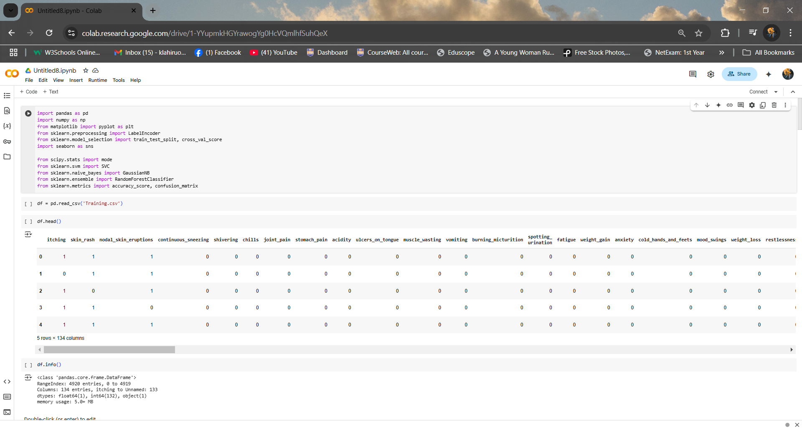

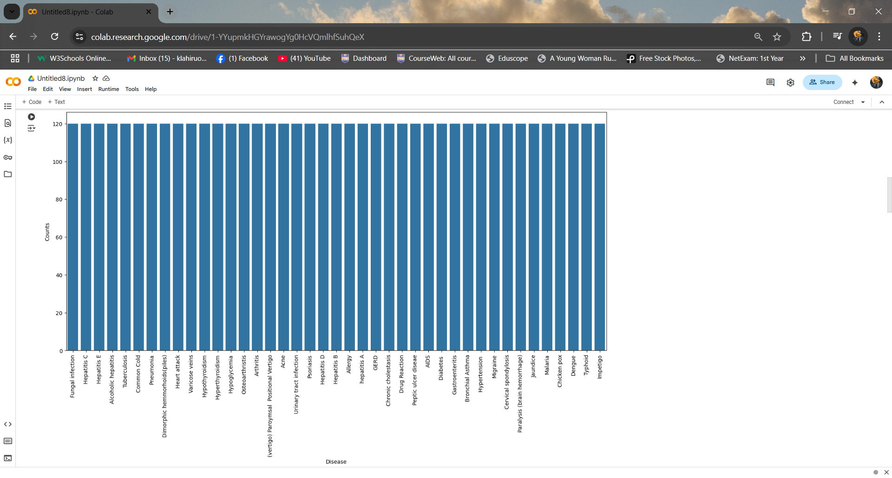
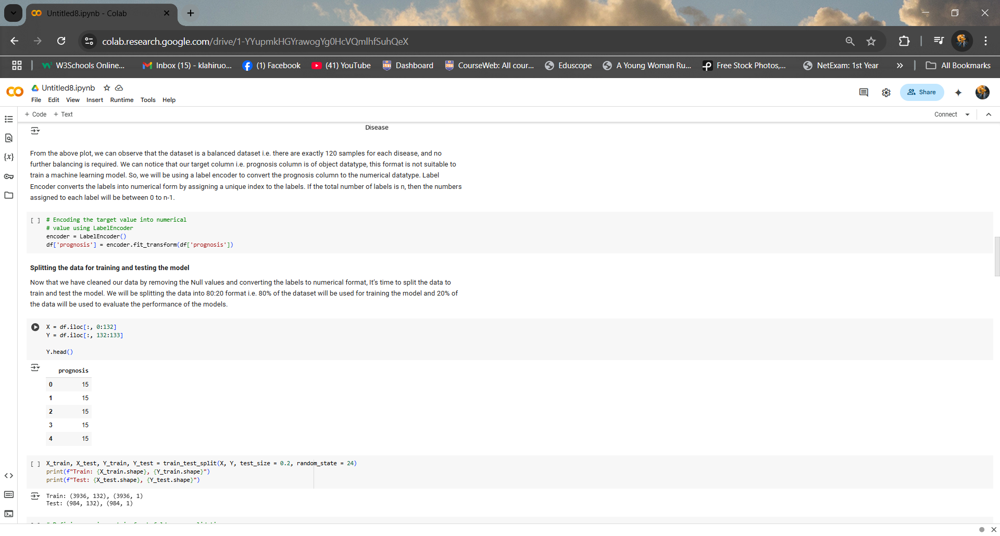
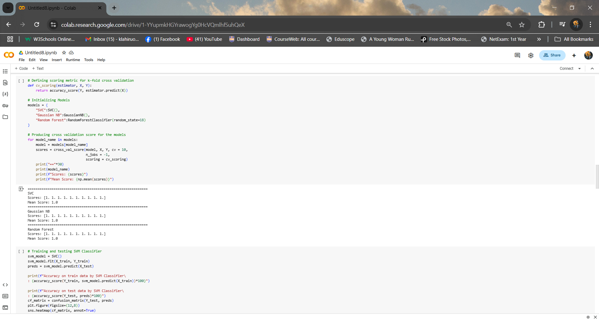
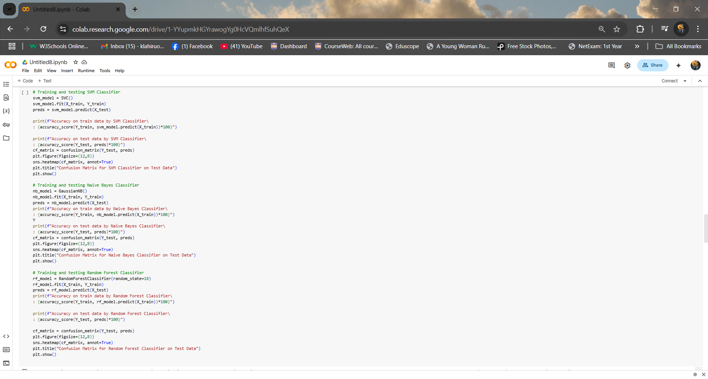
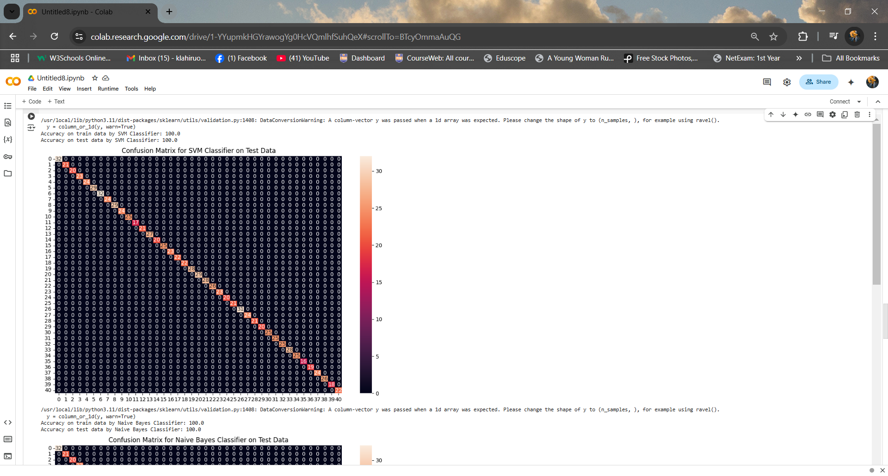
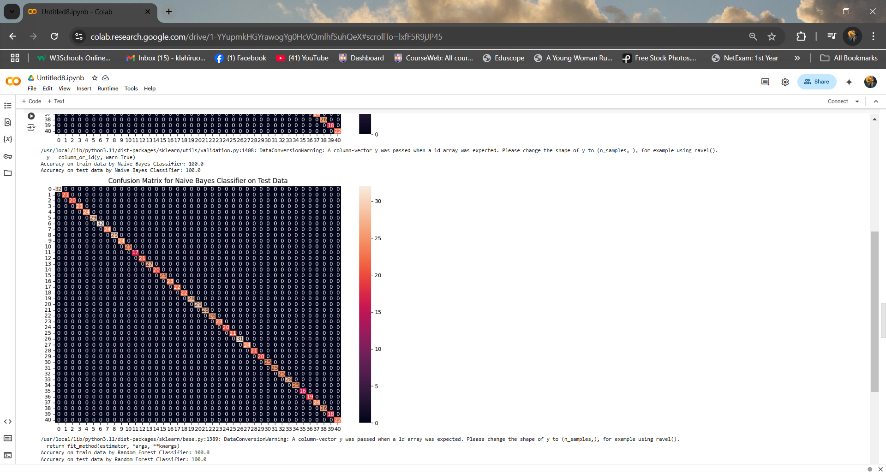
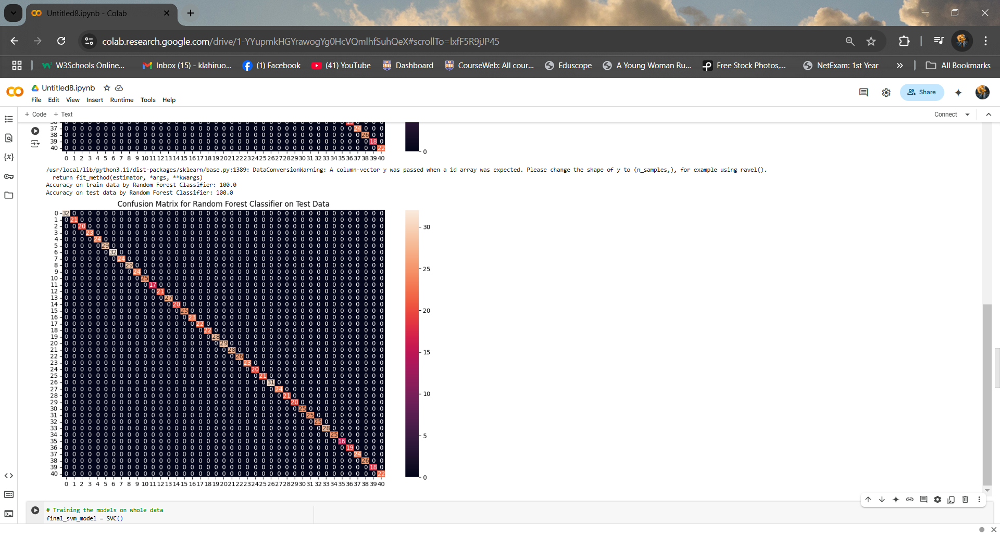
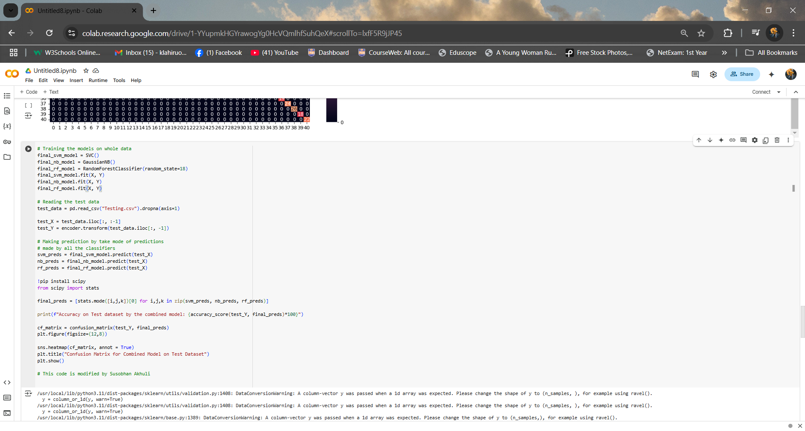
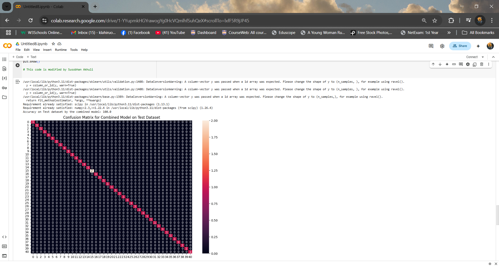
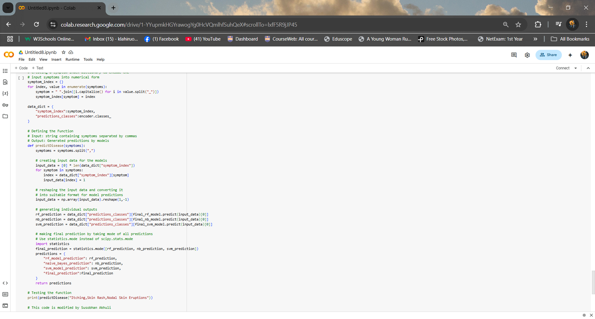
---

## 📊 Exploratory Data Analysis  
Here are some **visual insights** extracted from the dataset:

### 🔹 Symptom Frequency Distribution  


### 🔹 Correlation Heatmap  


---

## ⚙️ How to Run the Project  
### 1️⃣ Clone the Repository  
```bash
git https://github.com/oshanLahiru0307/analyse-data-and-build-ml-model-using-classification.git
